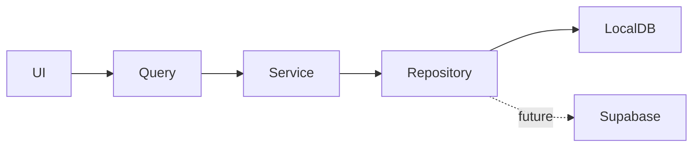

# Build an RMIT Team Work Management App

You are a senior full-stack product engineer and product designer.

Build a polished internal work-management web application inspired by the **interaction model of monday.com**, but do **not** copy monday.com branding, proprietary assets, exact visual styling, or code.

This application is intended for an internal RMIT creative/marketing team to manage:

- accounts
- teams
- members
- workspaces
- multiple boards
- groups within boards
- tasks/items
- owners
- statuses
- priorities
- timelines
- due dates
- dependencies
- comments
- updates
- files/attachments placeholders
- board views
- filters
- search
- notifications
- activity history

The MVP should feel like a real production application rather than a demo.

---

# 1. IMPORTANT DEVELOPMENT RULES

## Local-first development

Do NOT connect to a real Supabase project yet.

The application must run completely locally.

However, architect the project so that Supabase can replace the local/mock backend with minimal changes later.

Create:

- database/domain types
- repository interfaces
- service layer
- mock/local implementations
- Supabase implementation stubs
- SQL schema/migrations intended for Supabase/Postgres
- RLS policy plans/scripts

But:

- do not require Supabase credentials
- do not make external Supabase API calls
- do not require the user to create a Supabase project
- do not block the application if environment variables are missing

The local app should work immediately after:

```bash
npm install
npm run dev
```

Use seeded local data.

---

# 2. TECH STACK

Use a modern TypeScript stack.

Preferred:

- Next.js
- React
- TypeScript
- App Router
- Tailwind CSS
- shadcn/ui
- Lucide icons
- TanStack Query
- Zustand where appropriate for transient UI state
- React Hook Form
- Zod
- dnd-kit for drag-and-drop
- date-fns
- Supabase JS client installed but NOT connected
- Vitest
- React Testing Library
- Playwright for core E2E flows

Avoid unnecessary dependencies.

Use strict TypeScript.

Do not use `any` unless absolutely unavoidable.

---

# 3. HIGH-LEVEL ARCHITECTURE

Organize the application by domain rather than creating one huge components folder.

Suggested structure:

```text
src/
  app/
    login/
    onboarding/
    workspace/
      [workspaceId]/
        page.tsx
        boards/
          [boardId]/
            page.tsx
        my-work/
        inbox/
        members/
        settings/

  components/
    ui/
    layout/
    shared/

  features/
    auth/
    workspace/
    teams/
    boards/
    groups/
    items/
    columns/
    comments/
    notifications/
    activity/
    search/

  domain/
    auth/
    workspace/
    board/
    item/
    user/
    team/

  data/
    repositories/
    local/
    supabase/
    seed/

  lib/
    supabase/
    validation/
    permissions/
    dates/
    utils/

  hooks/

  types/

supabase/
  migrations/
  policies/
  seed.sql

tests/
```

Keep presentation, domain logic, and persistence separate.

Components should NOT directly call Supabase.

Use repository/service interfaces.

Example:

```text
BoardRepository
  ├── LocalBoardRepository
  └── SupabaseBoardRepository
```

The active implementation during development must be local.

---

# 4. PRODUCT MODEL

The hierarchy should be:

```text
Account/User
    ↓
Workspace
    ↓
Teams
    ↓
Boards
    ↓
Groups
    ↓
Items
    ↓
Subitems
```

A workspace can contain many teams.

A board belongs to a workspace.

A board can optionally be owned by a team.

Users can belong to multiple teams.

Boards can have multiple members.

---

# 5. USER MODEL

Create a User entity.

Fields:

```text
id
email
firstName
lastName
displayName
avatarUrl
jobTitle
department
timezone
createdAt
updatedAt
```

Users should have visually identifiable avatars.

Generate initials-based avatars when no avatar exists.

---

# 6. WORKSPACE MODEL

A user may eventually belong to multiple workspaces.

For the MVP, seed one:

```text
RMIT Creative Team
```

Fields:

```text
id
name
slug
logoUrl
createdAt
updatedAt
```

Workspace roles:

```text
OWNER
ADMIN
MEMBER
GUEST
```

---

# 7. TEAMS

Example seeded teams:

```text
Vietnam Creative
Melbourne Creative
Campaigns
Digital
Brand
Content
```

Team fields:

```text
id
workspaceId
name
description
color
icon
createdAt
updatedAt
```

Team members:

```text
teamId
userId
role
```

Allow:

- create team
- rename team
- change team color/icon
- add/remove member locally
- view team members
- archive team

---

# 8. BOARDS

Boards are the core of the application.

Board fields:

```text
id
workspaceId
teamId?
name
description
type
visibility
ownerId
createdAt
updatedAt
archivedAt?
```

Board type:

```text
MAIN
PRIVATE
SHAREABLE
```

Board visibility:

```text
WORKSPACE
TEAM
PRIVATE
```

Seed example boards:

```text
Semester 1 Campaign
Masterclass Assets
RMITinerary 2026
Always-On Content
DOOH Production
Creative Requests
```

Allow users to:

- create board
- rename board
- duplicate board
- favourite board
- archive board
- delete board
- move board between teams
- change board icon
- change board color
- configure board members

---

# 9. BOARD INTERFACE

The primary interface should resemble a modern spreadsheet/project-management hybrid.

It should NOT feel like a generic admin dashboard.

Use a large edge-to-edge workspace.

Header:

```text
Board title
Board description
Favourite button
Members
Invite
Activity
Automations placeholder
Integrations placeholder
...
```

Below that:

```text
Main Table
Kanban
Timeline
Calendar
Files
+
```

Only Main Table must be fully implemented initially.

Kanban should also be functional if reasonable.

Timeline/Calendar can initially be usable simplified views.

---

# 10. BOARD GROUPS

Each board contains groups.

Example:

```text
To Start
In Progress
Waiting for Feedback
Completed
```

Groups have:

```text
id
boardId
name
color
position
collapsed
createdAt
```

Allow:

- create group
- rename group
- collapse group
- reorder groups
- duplicate group
- delete group

Dragging groups should update their order locally.

---

# 11. BOARD ITEMS / TASKS

Each group contains items.

Item fields:

```text
id
boardId
groupId
parentItemId?
name
description?
position
createdBy
createdAt
updatedAt
archivedAt?
```

An item behaves like a row in monday.com.

Items can have dynamic column values.

Allow:

- create item
- rename item inline
- duplicate
- move between groups
- archive
- delete
- drag/reorder
- open item detail panel
- create subitems

---

# 12. BOARD COLUMNS

Boards must support configurable columns.

Column model:

```text
id
boardId
name
type
settings
position
width
createdAt
```

Supported MVP types:

```text
TEXT
LONG_TEXT
STATUS
PERSON
DATE
TIMELINE
NUMBER
PRIORITY
CHECKBOX
LINK
TAGS
FILES
DEPENDENCY
```

Column values should use a normalized model rather than adding database columns dynamically.

For example:

```text
ItemColumnValue
id
itemId
columnId
valueJson
updatedAt
```

Keep the architecture compatible with JSONB in Postgres.

---

# 13. STATUS COLUMN

Status should be one of the nicest interactions.

Example labels:

```text
Not Started
Working On It
Waiting
Stuck
Done
```

Users should be able to:

- click cell
- open popover
- select status
- immediately update UI
- customize available statuses later

Use visually clear colored pills/cells.

Do not overuse gradients.

---

# 14. PRIORITY

Default priorities:

```text
Critical
High
Medium
Low
```

Make them visually distinct.

Allow empty priority.

---

# 15. PERSON / OWNER COLUMN

Allow:

- single user
- multiple users

Clicking the cell should show a searchable member picker.

Show overlapping avatars when multiple users are assigned.

---

# 16. DATE + TIMELINE

Date column:

```text
dueDate
```

Timeline:

```text
startDate
endDate
```

Use clean calendar/date pickers.

Highlight overdue tasks.

---

# 17. DEPENDENCIES

Allow one item to depend on another item on the same board.

For MVP:

- select dependent item
- show dependency relationship
- indicate blocked items

Do not build advanced automatic scheduling yet.

---

# 18. SUBITEMS

Items may contain subitems.

Clicking an expand control should reveal subitems underneath the parent item.

Subitems support:

- name
- status
- owner
- due date
- priority

Use the same basic data architecture as items via `parentItemId`.

---

# 19. ITEM DETAIL PANEL

Clicking an item's name should open a right-side panel without leaving the board.

Panel approximately:

```text
-------------------------------------
Item name

Overview | Updates | Activity
-------------------------------------

Description

Owners

Status

Priority

Timeline

Dependencies

Subitems

Updates/comments
-------------------------------------
```

The board should remain visible behind the panel.

Panel should be routable if practical so refreshing can reopen the selected item.

---

# 20. COMMENTS / UPDATES

Each item has an Updates tab.

Users can post messages.

Comment fields:

```text
id
itemId
authorId
body
createdAt
updatedAt
```

Support:

- basic text
- @mention UI placeholder
- timestamps
- edit own comment
- delete own comment

Rich text is not required for MVP.

---

# 21. ACTIVITY LOG

Record important actions.

Examples:

```text
Danh changed Status from Working On It to Done
Emily assigned Jun
Jun changed Due Date from Sep 8 to Sep 11
Danh moved the item to Completed
```

Activity fields:

```text
id
workspaceId
boardId?
itemId?
actorId
eventType
metadata
createdAt
```

Display activities in chronological order.

---

# 22. BOARD TOOLBAR

Create a functional toolbar above the table.

Controls:

```text
New Item
Search
Person
Filter
Sort
Hide
Group By
```

Search:

Search item names immediately.

Filters:

Support at least:

- person
- status
- priority
- date
- group

Allow multiple filters.

Sort:

Support:

- item name
- due date
- priority
- status
- created date

---

# 23. TABLE UX

This is extremely important.

The board table must feel responsive and polished.

Requirements:

- sticky board toolbar
- sticky column headings
- horizontal scrolling
- adjustable column widths if feasible
- row hover states
- inline editing
- keyboard-friendly editing
- drag rows
- drag groups
- clear selection state
- group collapse
- bulk selection
- bulk archive/delete/move actions
- smooth optimistic updates

Do not make every cell look like an input field.

Cells should look like display values until interacted with.

---

# 24. KANBAN VIEW

Create a simple functional Kanban view.

Use the Status column as Kanban lanes.

Example:

```text
Not Started
Working On It
Waiting
Done
```

Cards show:

```text
Item name
Owner
Priority
Due date
```

Allow dragging cards between statuses.

Changes must be reflected in Main Table immediately.

---

# 25. MY WORK

Create `/my-work`.

Show tasks assigned to the current user across all boards.

Sections:

```text
Overdue
Today
This Week
Later
No Date
Completed
```

Each item should show:

```text
task name
board
group
status
priority
due date
```

Clicking one opens its detail panel or board.

---

# 26. HOME / WORKSPACE DASHBOARD

Create a useful workspace homepage.

Do not make it a useless analytics dashboard.

Include:

### Recently visited

Recent boards.

### My work

Important assigned tasks.

### Favourites

Favourite boards.

### Teams

Teams the user belongs to.

### Recent activity

Small feed.

---

# 27. SIDEBAR

Create a collapsible left navigation.

Structure:

```text
[RMIT mark placeholder]
RMIT Creative Team

Home
My Work
Inbox

Favourites
  Semester 1 Campaign
  RMITinerary 2026

Teams

  Vietnam Creative
      Masterclass Assets
      DOOH Production
      Creative Requests

  Melbourne Creative
      Semester 1 Campaign
      Always-On Content

+ Add Team
+ Add Board

--------------------------------

Search
Invite Members
Settings
User profile
```

Features:

- expandable teams
- favourite boards
- active board highlight
- collapse sidebar
- tooltips when collapsed
- responsive design

---

# 28. COMMAND / SEARCH EXPERIENCE

Implement global search.

Keyboard shortcut:

```text
Ctrl/Cmd + K
```

Search:

- boards
- items
- teams
- users

Display categorized results.

Selecting a result navigates appropriately.

---

# 29. INBOX / NOTIFICATIONS

Build a lightweight notification center.

Examples:

```text
Emily mentioned you in Masterclass Landing Page
Jun assigned you to Semester 1 DOOH
Due date changed for RMITinerary Final Artwork
```

Notification model:

```text
id
userId
type
title
body
entityType
entityId
readAt
createdAt
```

Support:

- unread/read
- mark all read
- open linked item

---

# 30. MEMBER MANAGEMENT

Workspace member page.

Show:

```text
Avatar
Name
Email
Job title
Teams
Workspace role
Status
```

Support locally:

- invite simulated user
- change role
- add/remove from teams
- deactivate

Do not send real emails.

---

# 31. ACCOUNT / LOGIN

Since Supabase Auth is NOT connected yet, create a development authentication provider.

Include:

```text
/login
```

Provide seeded accounts.

Example:

```text
danh@rmit.local
emily@rmit.local
jun@rmit.local
joanne@rmit.local
```

No password security is required for local mode.

Provide either:

```text
Select account
```

or:

```text
email + password
```

with obvious development credentials.

Architecture must use:

```text
AuthProvider interface
```

With:

```text
LocalAuthProvider
SupabaseAuthProvider
```

Switch providers through configuration later.

Do not scatter authentication logic throughout the app.

---

# 32. PERMISSIONS

Implement a permission utility.

Example:

```text
canViewBoard()
canEditBoard()
canDeleteBoard()
canManageMembers()
canManageWorkspace()
canCreateTeam()
```

Workspace:

```text
OWNER
ADMIN
MEMBER
GUEST
```

Board:

```text
OWNER
EDITOR
VIEWER
```

Do not hard-code permission checks directly into UI components.

---

# 33. SUPABASE-READY DATABASE DESIGN

Prepare PostgreSQL/Supabase SQL migrations for:

```text
profiles
workspaces
workspace_members
teams
team_members
boards
board_members
board_favourites
board_groups
board_columns
items
item_column_values
comments
activities
notifications
```

Use UUID primary keys.

Use:

```sql
created_at timestamptz
updated_at timestamptz
```

Use JSONB where appropriate.

Create indexes for common queries.

Example:

```text
items(board_id)
items(group_id)
item_column_values(item_id)
item_column_values(column_id)
comments(item_id)
activities(board_id)
workspace_members(user_id)
```

Do NOT execute migrations against an external database.

---

# 34. SUPABASE ROW LEVEL SECURITY

Prepare RLS policies in SQL but do not deploy them.

Policies should conceptually enforce:

- user must belong to workspace
- private boards only visible to board members
- team boards visible according to membership
- workspace admins can manage workspace
- users can modify permitted boards
- users can edit/delete their own comments
- notifications visible only to recipient

Put them in:

```text
supabase/policies/
```

Document assumptions.

---

# 35. LOCAL DATA LAYER

The local prototype needs persistent data across browser refreshes.

Use a local persistence approach appropriate for the architecture.

Requirements:

- no external server/database dependency required
- seeded initial state
- mutations persist locally
- reset demo data button
- architecture mirrors future Supabase repositories

Possible implementation:

```text
LocalRepository
    ↓
IndexedDB
```

Prefer IndexedDB over a giant localStorage JSON object.

A small IndexedDB abstraction is acceptable.

Do not couple React components directly to IndexedDB.

React components:

```text
UI
 ↓
hooks/query layer
 ↓
service
 ↓
repository
 ↓
local storage adapter
```

Later:

```text
UI
 ↓
hooks/query layer
 ↓
service
 ↓
repository
 ↓
Supabase
```

---

# 36. DATA FETCHING

Use TanStack Query for server-style state.

Even though data is currently local.

Use query keys such as:

```text
workspace
workspace-members
teams
boards
board
board-groups
board-items
item
comments
activity
notifications
my-work
```

Use optimistic mutation patterns where appropriate.

---

# 37. CLIENT STATE

Use Zustand only for ephemeral UI state such as:

```text
sidebar collapsed
selected items
active item panel
temporary table state
command palette
modal state
```

Do not duplicate persistent entities in both Zustand and TanStack Query.

---

# 38. DESIGN LANGUAGE

This app is intended for a professional creative team.

Visual direction:

- modern
- clean
- energetic
- dense but readable
- polished
- professional
- subtle personality
- not overly corporate
- not childish
- not generic SaaS template

Use mostly neutral UI surfaces.

RMIT red can be used as an accent, but do NOT make the entire interface red.

Suggested accent:

```text
#E61E2A
```

Possible supporting dark navy:

```text
#000054
```

Use these sparingly.

Board/group/status colors may use broader colors.

---

# 39. TYPOGRAPHY

Use a modern sans-serif UI font.

Prioritize:

- readability
- compact table layouts
- clear hierarchy

Board names should feel prominent.

Table text should be approximately 13–14px.

Avoid oversized SaaS landing-page typography inside the application.

---

# 40. SPACING

This is a work-management application, so information density matters.

Do not make every table row 70px tall.

Target approximately:

```text
36–44px
```

for standard task rows.

Use compact controls.

---

# 41. RESPONSIVE BEHAVIOR

Primary target:

```text
1440px desktop
```

Also support:

```text
1280px
1024px
```

Tablet/mobile support can be simplified.

On narrow layouts:

- sidebar collapses
- table scrolls horizontally
- item panel can become full screen

---

# 42. ACCESSIBILITY

Use:

- semantic HTML
- ARIA labels
- visible focus states
- keyboard navigation
- adequate contrast
- accessible dialogs/popovers
- proper button elements

Do not build clickable `<div>` elements when buttons are appropriate.

---

# 43. SEED DATA

Create meaningful realistic seed data rather than:

```text
Task 1
Task 2
Task 3
```

Seed people:

```text
Danh
Emily
Jun
Joanne
Duc
Tuyet
Hil
Grace
Jane
```

Seed example teams:

```text
Vietnam Creative
Melbourne Creative
Campaigns
Brand
```

Seed boards:

```text
Semester 1 Campaign
Masterclass Assets
RMITinerary 2026
DOOH Production
Creative Requests
Always-On Content
```

Example groups:

```text
Backlog
This Fortnight
In Progress
Internal Review
Stakeholder Review
Approved
Completed
```

Example tasks:

```text
Masterclass social asset – Speaker 1
Masterclass social asset – Dual speaker
Masterclass landing page hero
Sem 1 campaign storyboard
DOOH artwork adaptation
RMITinerary High Achiever
RMITinerary Pragmatist
RMITinerary Explorer
RMITinerary Independent
Prepare campaign image selections
Upload final production files
Chinese language adaptation
Review stakeholder feedback
```

Create enough seeded data that:

- filtering works
- sorting works
- My Work is useful
- notifications are visible
- boards feel populated
- Kanban is meaningful

Around 50–80 seeded items across boards is reasonable.

---

# 44. EMPTY STATES

Design good empty states.

Examples:

```text
No tasks match these filters.
```

```text
This group is empty.
Add an item to get started.
```

```text
No notifications yet.
```

Do not use giant illustrations.

Keep them subtle.

---

# 45. LOADING STATES

Even though the backend is local, simulate realistic loading where useful during development.

Use:

- skeletons
- subtle transitions

Do not use full-screen loading spinners for every interaction.

---

# 46. ERROR STATES

Create reusable error handling.

For example:

```text
Something went wrong while loading this board.

Try again
```

Log useful development information to the console.

---

# 47. TOASTS

Use small notifications for actions such as:

```text
Board duplicated
Item moved
3 items archived
Member added
Changes saved
```

Do NOT show a toast for every inline status change.

---

# 48. DRAG AND DROP

Use dnd-kit.

Support:

### Main Table

- reorder items inside group
- move item between groups
- reorder groups

### Kanban

- move cards between statuses

Persist order.

Use numeric position/order fields.

---

# 49. MODALS

Create reusable dialogs for:

```text
Create Board
Create Team
Invite Member
Delete Board
Archive Items
Board Settings
Workspace Settings
```

Avoid one-off modal implementations.

---

# 50. BOARD CREATION

Create-board modal:

```text
Board Name

Team
[select]

Visibility
Workspace
Team
Private

Template
Blank
Campaign
Creative Production

Create Board
```

Templates should simply seed groups/columns.

---

# 51. BOARD TEMPLATES

Create three starter templates.

## Blank

Columns:

```text
Item
Owner
Status
Due Date
```

## Campaign

Groups:

```text
Planning
Production
Review
Live
Completed
```

Columns:

```text
Item
Owner
Status
Priority
Timeline
Channel
```

## Creative Production

Groups:

```text
Briefing
Design
Internal Review
Stakeholder Review
Approved
Delivered
```

Columns:

```text
Item
Designer
Status
Priority
Due Date
Format
Market
```

---

# 52. BOARD SETTINGS

Settings should include:

```text
General
Members
Columns
Permissions
Archive
Danger Zone
```

Functional MVP:

- rename
- description
- board visibility
- team
- members
- archive board
- delete board

---

# 53. WORKSPACE SETTINGS

Sections:

```text
General
Members
Teams
Permissions
Data
```

Data section should provide:

```text
Reset demo data
```

Require confirmation.

---

# 54. URL STRUCTURE

Use understandable URLs.

Example:

```text
/
 /login
 /workspace/rmit
 /workspace/rmit/my-work
 /workspace/rmit/inbox
 /workspace/rmit/members
 /workspace/rmit/settings
 /workspace/rmit/boards/rmitinerary-2026
```

Use IDs internally where appropriate but human-friendly slugs are preferred for visible URLs.

---

# 55. FUTURE SUPABASE CONFIGURATION

Create:

```text
.env.example
```

Containing:

```text
NEXT_PUBLIC_DATA_PROVIDER=local

NEXT_PUBLIC_SUPABASE_URL=
NEXT_PUBLIC_SUPABASE_ANON_KEY=
```

The app should default to:

```text
local
```

Architecture should eventually allow:

```text
NEXT_PUBLIC_DATA_PROVIDER=supabase
```

Do not enable Supabase mode until its repository implementation is actually complete.

If Supabase variables are missing:

DO NOT crash in local mode.

---

# 56. SUPABASE CLIENT

Create the future client setup in:

```text
src/lib/supabase/
```

But do not initialize external connections while using local mode.

Add clear TODO documentation explaining how to connect later.

---

# 57. SUPABASE STORAGE

Prepare the architecture for attachments using Supabase Storage.

For local MVP:

Attachments can be:

```text
filename
size
mimeType
mockUrl/localUrl
```

Do not upload files externally.

Future bucket:

```text
workspace-files
```

Store metadata separately.

---

# 58. REALTIME SUPPORT

Do not implement Supabase realtime yet.

But isolate board querying/mutations enough that realtime subscriptions can be added later.

Document where subscriptions would be initialized.

Potential future realtime targets:

```text
items
item_column_values
comments
activities
notifications
```

---

# 59. AUTOMATIONS

Do NOT build a full workflow automation engine yet.

Add an Automations button with a polished placeholder modal.

Show examples:

```text
When status changes to Done → notify owner

3 days before due date → notify assignee

When item moves to Stakeholder Review → notify board owner
```

Clearly label as:

```text
Coming later
```

Do not pretend they are active.

---

# 60. INTEGRATIONS

Similarly add an Integrations placeholder.

Possible future:

```text
Microsoft Teams
Outlook
OneDrive
Google Drive
Slack
```

No external integrations now.

---

# 61. PERFORMANCE

Board tables may eventually contain hundreds/thousands of rows.

Architect accordingly.

Avoid unnecessary rerenders.

Memoize expensive cells where useful.

Do not prematurely over-engineer virtualization, but structure the table so virtualization can be introduced later.

---

# 62. TESTS

Write meaningful tests.

Unit tests:

```text
permissions
sorting
filtering
date grouping
repository behavior
board template creation
```

Component tests:

```text
StatusCell
PersonPicker
BoardToolbar
ItemDetailPanel
```

E2E tests:

```text
login
open board
create item
change status
assign owner
move item between groups
create board
open My Work
filter board
```

---

# 63. DEVELOPMENT UTILITIES

Add development-only tools.

Example:

```text
Reset Seed Data
Switch Current User
```

The user switcher will help simulate collaboration locally.

Put these in a discreet development menu.

Do not show them as core production UI.

---

# 64. README

Write a strong README.

Include:

```text
What the application is
Technology stack
Architecture
Local development
Seed users
Project structure
Data-provider architecture
How local persistence works
How to reset data
Testing
Future Supabase connection steps
Database schema overview
RLS strategy
Future realtime strategy
```

Include diagrams using Mermaid where useful.

Example:



---

# 65. IMPLEMENTATION ORDER

Do not attempt everything simultaneously.

Work in phases.

## Phase 1 – Foundation

Build:

- project
- design system
- routing
- domain types
- local data layer
- seed data
- repository architecture
- authentication abstraction

Verify it works.

## Phase 2 – Application Shell

Build:

- sidebar
- workspace layout
- home
- teams
- board navigation
- user menu

Verify it works.

## Phase 3 – Board

Build:

- groups
- columns
- items
- inline editing
- status
- owner
- date
- priority
- add item
- collapse groups

Verify it works.

## Phase 4 – Interactions

Build:

- drag-and-drop
- filters
- sorting
- search
- bulk selection
- item panel

Verify it works.

## Phase 5 – Collaboration

Build:

- comments
- activity
- notifications
- My Work
- members

Verify it works.

## Phase 6 – Additional Views

Build:

- Kanban
- simplified timeline
- simplified calendar

Verify it works.

## Phase 7 – Supabase Preparation

Build:

- migrations
- schema
- RLS SQL
- Supabase repository stubs
- environment configuration
- integration documentation

Do NOT connect externally.

## Phase 8 – QA

Run:

```text
lint
typecheck
unit tests
E2E tests
production build
```

Fix errors before considering the work complete.

---

# 66. WORKING STYLE

Do not just create placeholder files for the entire architecture.

Build each feature properly before moving on.

After every significant phase:

1. run the application
2. run TypeScript checks
3. run relevant tests
4. inspect for console errors
5. fix problems
6. continue

Do not leave broken routes.

Do not leave buttons that appear functional but silently do nothing.

If a feature is intentionally not implemented, visually identify it as:

```text
Coming later
```

---

# 67. CODE QUALITY

Follow these rules:

- small focused components
- reusable primitives
- feature-based architecture
- no giant 1000-line board component
- no duplicate domain models
- no direct persistence logic inside components
- no unexplained magic values
- no unnecessary React effects
- no storing derivable state
- no excessive prop drilling
- no unnecessary global state
- no blanket disabling of ESLint
- no fake API delays in production code
- no hard-coded current user inside components

---

# 68. PRODUCT QUALITY

Do not make this look like an AI-generated dashboard template.

Specifically avoid:

- four giant statistic cards at the top
- excessive rounded cards
- excessive gradients
- huge whitespace
- excessive shadows
- rainbow UI
- glassmorphism
- oversized headings
- marketing-site visual patterns

This is a daily productivity tool.

Prioritize:

```text
information density
clarity
speed
predictability
interaction quality
```

The table/board should be the visual focus.

---

# 69. DETAIL INTERACTIONS

Add quality-of-life interactions where sensible:

- double-click group title to rename
- Enter creates item below
- Escape cancels editing
- Cmd/Ctrl + K opens search
- hovering avatar shows member name
- overdue dates have subtle warning treatment
- Done items appear slightly de-emphasized
- board favourite toggles immediately
- clicking board title allows rename for authorized users
- sidebar remembers collapsed state
- board remembers selected view
- filters have visible active indicator
- selected row count appears during bulk selection

---

# 70. ACTIVITY DESIGN

The activity feed should be human-readable.

Do not expose raw database events.

Convert:

```text
ITEM_COLUMN_VALUE_UPDATED
```

into:

```text
Danh changed Status from Working On It to Done
```

Include:

- avatar
- actor
- action
- relative timestamp

---

# 71. TABLE COLUMN CONFIGURATION

Users should be able to:

- add column
- rename column
- hide column
- reorder columns
- delete custom column
- resize columns if practical

Required Item Name column cannot be deleted.

Persist configuration.

---

# 72. BOARD HEADER EXAMPLE

Aim for something roughly like:

```text
←  RMITinerary 2026                         ☆   👤👤👤   Invite   •••

Publication production tracking and creative approvals

Main Table   Kanban   Timeline   Calendar   Files    +

+ New Item    Search    Person    Filter    Sort    Hide

----------------------------------------------------------------------
            Owner        Status           Priority       Due Date
----------------------------------------------------------------------
▼ Design
  High Achiever     DD    Done             High           Sep 08
  Pragmatist        JT    Working On It    High           Sep 10
  Explorer          DD    Review           Medium         Sep 11
  Independent       JT    Not Started      Medium         Sep 15

  + Add item

▼ Production
  Chinese version   DD    Not Started      Low            Sep 22
```

This is only structural guidance.

Do not clone this ASCII layout literally.

---

# 73. LOCAL DEMO EXPERIENCE

When I first launch the app, I should immediately be able to:

1. select/sign in as Danh
2. enter RMIT Creative Team
3. see several teams
4. see multiple boards
5. open RMITinerary 2026
6. see populated groups/tasks
7. change a status
8. assign a user
9. change a due date
10. drag a task
11. filter by owner
12. open the task panel
13. post a comment
14. visit My Work
15. create another board
16. refresh the browser and retain the changes

This flow must work BEFORE Supabase is connected.

---

# 74. SUPABASE MIGRATION EXPECTATION

The local domain model and Supabase schema must closely correspond.

Avoid designing a local-only architecture that needs to be rewritten later.

The eventual Supabase implementation should mainly involve replacing repositories such as:

```text
LocalBoardRepository
```

with:

```text
SupabaseBoardRepository
```

rather than changing UI components.

---

# 75. FUTURE AUTH FLOW

Document how local authentication will eventually become:

```text
Supabase Auth
        ↓
auth.users
        ↓
profiles
        ↓
workspace_members
```

Profile ID should correspond to the Supabase authenticated user UUID.

Do not implement external authentication yet.

---

# 76. FUTURE ENTERPRISE CONSIDERATIONS

Do not implement these now, but document extension points for:

- Microsoft Entra ID / SSO
- RMIT identity provider
- audit logs
- retention policies
- workspace exports
- granular permissions
- guest access
- API integrations
- webhook automation
- realtime collaboration
- organization-level administration

Do not over-engineer MVP code for these yet.

---

# 77. DELIVERABLES

At completion I expect:

```text
Working Next.js application
Responsive application shell
Local authentication
Workspace
Teams
Multiple boards
Board groups
Board items
Subitems
Dynamic columns
Statuses
Owners
Priority
Dates
Timeline values
Dependencies
Comments
Activity
Notifications
My Work
Search
Filters
Sorting
Drag-and-drop
Kanban
Seed data
Local persistence
Supabase-ready schema
Supabase RLS scripts
Supabase repository architecture
Tests
README
.env.example
```

---

# 78. DO NOT CONNECT TO SUPABASE

This requirement is important.

For this stage:

```text
DATA_PROVIDER=local
```

must be the only operational provider.

Do NOT ask me for:

- Supabase URL
- Supabase anon key
- Supabase service role key
- project ID
- database password

Do not perform external database migrations.

Do not deploy anything.

Prepare the architecture only.

---

# 79. DEFINITION OF DONE

The task is NOT complete merely because pages render.

It is complete when:

- the app starts successfully
- seeded users can sign in
- multiple boards work
- multiple teams work
- data survives refresh
- core board interactions work
- drag-and-drop works
- filters work
- My Work aggregates tasks
- comments work
- activities update
- TypeScript passes
- lint passes
- tests pass
- production build passes
- Supabase schema is documented
- Supabase migration files exist
- no live Supabase connection is required

---

# 80. FINAL INSTRUCTION

Begin by examining the repository.

If it is empty, initialize the project.

Then implement Phase 1.

Proceed phase-by-phase without asking me to approve every small implementation decision.

When there are multiple reasonable technical options:

1. choose the simplest production-quality solution
2. explain the choice briefly in your progress notes
3. continue implementation

Do not spend excessive time discussing architecture instead of building.

Prioritize a working vertical slice early:

```text
Login
→ Workspace
→ Board
→ Group
→ Item
→ Status change
→ persistence
```

Once that works, expand the product systematically.

Treat the application as something a real internal team could eventually use every day, not as a UI prototype.