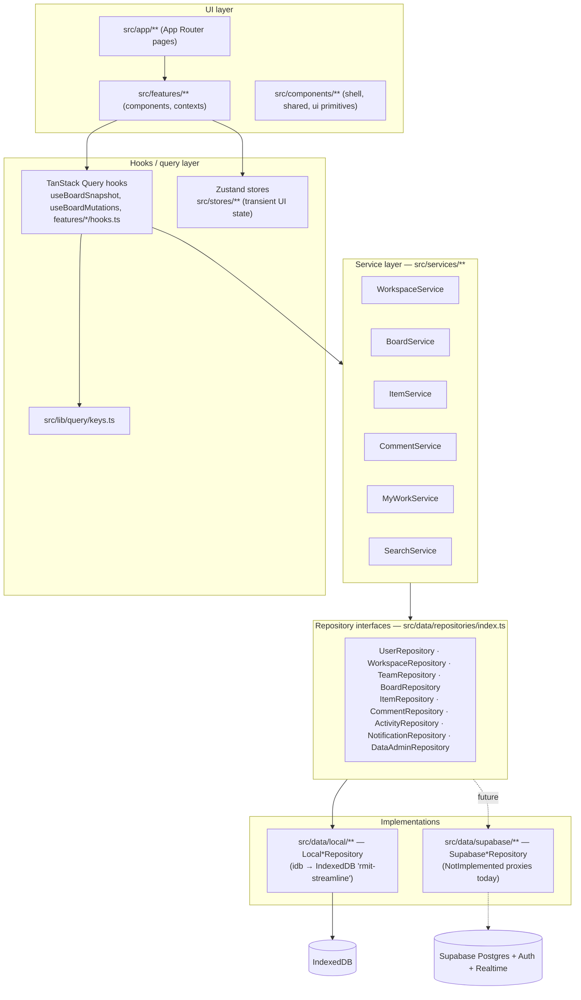
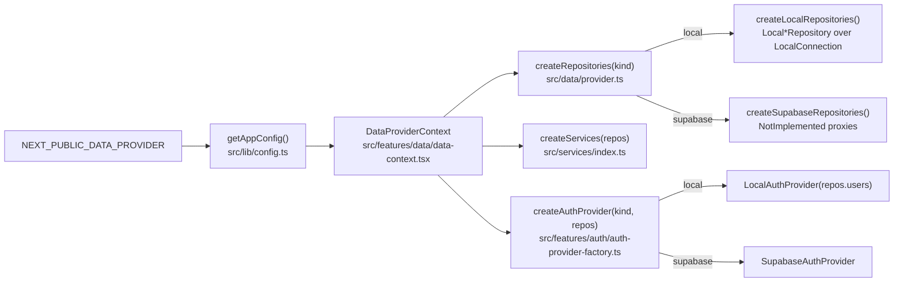
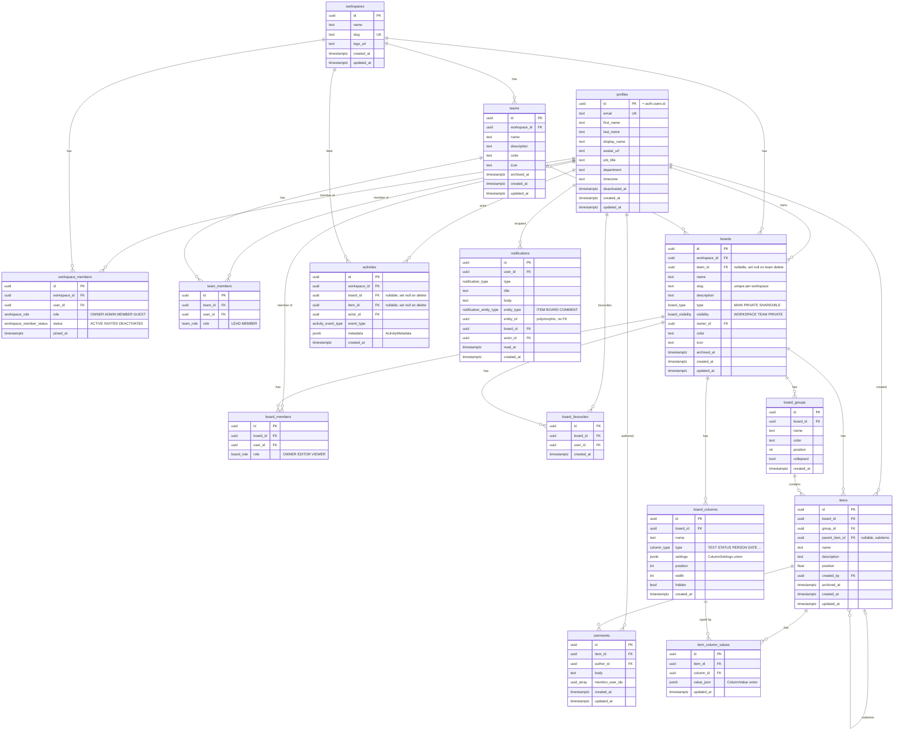

# Streamline — RMIT Creative Team work management

Streamline is an internal work-management application for the RMIT creative and marketing team. It follows the interaction model popularised by monday.com — a workspace holds teams and boards, a board is a table of groups, each group holds items (tasks) and subitems, and every item carries a configurable set of typed columns (status, people, dates, timelines, priority, tags, files, dependencies and so on). Around the board sit the supporting surfaces a team needs day to day: My Work, an Inbox of notifications, a members directory, team pages, an activity history and a command palette for search.

The current build is **local-first**. Every record lives in the browser's IndexedDB behind a set of repository interfaces; sign-in uses a password-less `LocalAuthProvider` that accepts any seeded account. Supabase (`@supabase/supabase-js`) is installed and the Postgres schema and row-level-security policies are written, but nothing talks to a Supabase project yet — the Supabase repositories are stubs that throw if selected. The architecture is deliberately arranged so that switching `NEXT_PUBLIC_DATA_PROVIDER` from `local` to `supabase` is the only change the UI ever sees.

Streamline is a Next.js 16 / React 19 application written in TypeScript, styled with Tailwind CSS 4 and Radix UI primitives, with TanStack Query for server-state and Zustand for transient UI state.

## The 16-step local demo flow

After `npm run dev` and opening <http://localhost:3000>, the following flow works end to end with no configuration:

1. On the sign-in screen pick **Danh Nguyen** (or type `danh@rmit.local`). No password is required.
2. You land in the **RMIT Creative Team** workspace (`/workspace/rmit`).
3. The sidebar lists the seeded **teams** — Vietnam Creative, Melbourne Creative, Campaigns, Digital, Brand and Content — each expandable to show its boards.
4. Six seeded **boards** are available: Semester 1 Campaign, Masterclass Assets, RMITinerary 2026, DOOH Production, Creative Requests and Always-On Content.
5. Open **RMITinerary 2026** (under Vietnam Creative, or from Favourites / Recently visited on Home).
6. The board opens on the **Main Table** view with populated groups (Backlog, Design, Production, Stakeholder Review, Completed), items, subitems and column values.
7. Click any **Status** cell and choose a new label. The change is applied optimistically and an activity entry is recorded.
8. Click an **Owner** cell and **assign a user**. The assignee receives an `ASSIGNED` notification in their Inbox.
9. Click a **Due Date** cell and pick a new date. Owners other than you receive a `DUE_DATE_CHANGED` notification.
10. **Drag a task** by its handle to reorder it or drop it into another group (dnd-kit). Subitems move with their parent.
11. Use the **Person** filter in the toolbar to **filter by owner** (the Filter button adds status, priority, group and date filters; Sort and Search are alongside).
12. Click an item name to **open the task panel** (`?item=<id>` in the URL, so a refresh reopens it). It has Overview, Updates and Activity tabs.
13. On the **Updates** tab **post a comment** — type `@` to mention a teammate, which creates a `MENTION` notification for them.
14. Open **My Work** from the sidebar to see everything assigned to you across boards, bucketed into Overdue, Today, This Week, Later, No Date and Completed.
15. Use **Add Board** in the sidebar to **create another board** from the Blank, Campaign or Creative Production template.
16. **Refresh the browser.** All changes persist because they were written to IndexedDB; the session is restored from `localStorage`.

## Technology stack

Versions are the ranges declared in `package.json`.

| Area | Package | Version |
| --- | --- | --- |
| Framework | `next` | 16.3.4 |
| UI runtime | `react`, `react-dom` | 19.2.8 |
| Language | `typescript` | ^5.9.0 |
| Styling | `tailwindcss`, `@tailwindcss/postcss` | ^4.3.3 |
| Styling utilities | `tw-animate-css`, `class-variance-authority`, `clsx`, `tailwind-merge` | ^1.4.0 / ^0.7.1 / ^2.1.1 / ^3.6.0 |
| Primitives | `radix-ui` | ^1.6.7 |
| Command palette | `cmdk` | ^1.1.1 |
| Icons | `lucide-react` | ^1.40.0 |
| Toasts | `sonner` | ^2.0.8 |
| Server state | `@tanstack/react-query` | ^5.102.8 |
| Client state | `zustand` | ^5.0.15 |
| Local persistence | `idb` | ^8.0.3 |
| Drag and drop | `@dnd-kit/core`, `@dnd-kit/sortable`, `@dnd-kit/modifiers`, `@dnd-kit/utilities` | ^6.3.1 / ^10.0.0 / ^9.0.0 / ^3.2.2 |
| Forms and validation | `react-hook-form`, `@hookform/resolvers`, `zod` | ^7.87.0 / ^5.9.1 / ^4.5.4 |
| Dates | `date-fns`, `react-day-picker` | ^4.1.0 / ^10.0.1 |
| Backend SDK (not yet connected) | `@supabase/supabase-js` | ^2.115.0 |
| Unit tests | `vitest`, `@vitejs/plugin-react`, `happy-dom`, `fake-indexeddb` | ^4.0.0 / ^6.1.1 / ^20 / ^6.2.5 |
| Component tests | `@testing-library/react`, `@testing-library/dom`, `@testing-library/user-event`, `@testing-library/jest-dom` | ^16.3.0 / ^10.4.1 / ^14.6.1 / ^6.9.1 |
| End-to-end tests | `@playwright/test` | ^1.62.1 |
| Linting | `eslint`, `eslint-config-next` | ^9 / 16.3.4 |

Runtime: Node.js 20.9 or newer (developed on Node 22 with npm 10.9).

## Architecture



### Layers

- **UI (`src/app`, `src/features`, `src/components`)** — App Router pages are thin wrappers that render a feature component. Features own screens, dialogs, cells and pickers. `src/components/ui` holds the Radix-based primitives; `src/components/layout` the shell (sidebar, user menu); `src/components/shared` reusable pieces (avatars, inline edit, empty/error states).
- **Hooks / query layer** — All reads go through TanStack Query with keys defined centrally in `src/lib/query/keys.ts`. `useBoardSnapshot` loads a board's groups, columns, items and values in one query; `useBoardMutations` applies optimistic patches to that snapshot, calls a service, rolls back on error and invalidates related keys (`myWork`, `activity`, `notifications`) when the last pending mutation settles. Three React contexts wire the graph: `DataProviderContext` (builds repositories → services → auth provider once per app), `AuthProviderContext` (session + current user) and `WorkspaceProvider` (workspace, members, teams, boards, favourites and a precomputed `PermissionContext`). Zustand stores hold transient UI state only: per-board search/filters/sort/selection (`board-ui-store.ts`) and sidebar/palette preferences (`ui-store.ts`).
- **Services (`src/services`)** — Use-case orchestration: `BoardService` (create from template, rename with slug regeneration, duplicate, groups, columns, members, favourites), `ItemService` (snapshot loading, create/rename/move/archive/delete/duplicate, `setValue` with activity + notification fan-out), `CommentService` (mentions → notifications), `MyWorkService` (assigned items bucketed by due date), `SearchService`, `WorkspaceService` (invites, roles, teams). Services depend only on the `Repositories` interface.
- **Repositories (`src/data/repositories/index.ts`)** — Pure persistence contracts returning domain types from `src/domain/**`. No business rules live here.
- **Implementations** — `src/data/local/**` implements every interface on top of `idb`; `src/data/supabase/**` is the future Postgres implementation.

**Rule: components never touch persistence directly.** UI code imports `useServices()` (or a feature hook built on it) and never `Local*`/`Supabase*` classes, `idb`, or the Supabase client. Permission decisions come from the `can*` helpers in `src/lib/permissions/permissions.ts`, never from inspecting roles inline.

## Local development

```bash
npm install
npm run dev        # http://localhost:3000
```

Other scripts:

| Script | What it does |
| --- | --- |
| `npm run build` / `npm run start` | Production build and server |
| `npm run lint` | ESLint (`eslint .`, flat config in `eslint.config.mjs`) |
| `npm run typecheck` | `tsc --noEmit` (strict, `noUncheckedIndexedAccess`) |
| `npm test` / `npm run test:watch` | Vitest unit and component tests |
| `npm run test:e2e` | Playwright end-to-end tests |
| `npm run check` | lint + typecheck + test |

### `.npmrc`

The repository ships `.npmrc` with `legacy-peer-deps=true`. This is required because npm 10.9.x crashes while resolving Vitest's optional `jsdom` peer dependency; with legacy peer resolution the install completes normally. Do not remove it unless you have verified `npm install` on a clean checkout with your npm version.

### Environment variables

Copy `.env.example` to `.env.local` if you need to change anything. Nothing is required for local mode:

```dotenv
# Data provider: "local" (IndexedDB, default) or "supabase" (not yet enabled)
NEXT_PUBLIC_DATA_PROVIDER=local

# Only required when NEXT_PUBLIC_DATA_PROVIDER=supabase
NEXT_PUBLIC_SUPABASE_URL=
NEXT_PUBLIC_SUPABASE_ANON_KEY=
```

`src/lib/config.ts` reads these at runtime. If the provider is set to `supabase` but either Supabase variable is missing, it logs a warning and falls back to `local`; the app never fails to start because of missing configuration.

## Seed users

All accounts use the `@rmit.local` domain and sign in without a password in local mode. Definitions live in `src/data/seed/seed-data.ts` (`USER_SPECS`, `TEAM_SPECS`).

| Email | Name | Job title | Workspace role | Teams |
| --- | --- | --- | --- | --- |
| `danh@rmit.local` | Danh Nguyen | Senior Designer | OWNER | Vietnam Creative (lead), Campaigns |
| `emily@rmit.local` | Emily Carter | Creative Lead | ADMIN | Melbourne Creative (lead), Campaigns, Brand |
| `joanne@rmit.local` | Joanne Walsh | Campaign Manager | ADMIN | Campaigns (lead), Brand (lead) |
| `jun@rmit.local` | Jun Tanaka | Digital Producer | MEMBER | Digital (lead), Melbourne Creative, Campaigns |
| `duc@rmit.local` | Duc Tran | Motion Designer | MEMBER | Vietnam Creative, Brand |
| `tuyet@rmit.local` | Tuyet Le | Graphic Designer | MEMBER | Vietnam Creative, Content |
| `hil@rmit.local` | Hil Pham | Web Designer | MEMBER | Vietnam Creative, Digital |
| `grace@rmit.local` | Grace Kim | Content Strategist | MEMBER | Content (lead), Melbourne Creative, Digital |
| `jane@rmit.local` | Jane Morrison | Copywriter | GUEST | Melbourne Creative, Content |

The seed also creates one workspace (`RMIT Creative Team`, slug `rmit`), six teams, six boards with groups/columns/items/subitems/values, comments, an activity history, notifications (mostly addressed to Danh), favourites and recent-visit records. IDs are deterministic pseudo-UUIDs; dates are generated relative to "now" so My Work and Overdue always have content.

## Project structure

```text
RMIT_Streamline/
├─ .env.example
├─ .npmrc                          # legacy-peer-deps=true
├─ eslint.config.mjs · next.config.ts · postcss.config.mjs · tsconfig.json
├─ vitest.config.mts · playwright.config.ts
├─ public/
├─ supabase/
│  ├─ migrations/0001_initial_schema.sql
│  ├─ policies/0001_rls_policies.sql
│  ├─ policies/README.md
│  └─ seed.sql
├─ tests/
│  ├─ setup.ts                     # jest-dom, fake-indexeddb, DOM shims, next/* mocks
│  ├─ unit/                        # Vitest specs (+ components/, helpers/)
│  └─ e2e/                         # Playwright specs
└─ src/
   ├─ app/                         # Next.js App Router
   │  ├─ layout.tsx · providers.tsx · page.tsx · globals.css
   │  ├─ login/page.tsx
   │  └─ workspace/[workspaceSlug]/
   │     ├─ layout.tsx             # session + membership guard, AppShell
   │     ├─ page.tsx               # Home
   │     ├─ boards/[boardSlug]/page.tsx
   │     ├─ my-work/ · inbox/ · members/ · settings/ · teams/[teamId]/
   ├─ components/
   │  ├─ layout/                   # app-shell, sidebar, user-menu, full-page-loader
   │  ├─ shared/                   # user-avatar, inline-edit, color/icon pickers, states
   │  └─ ui/                       # Radix-based primitives (button, dialog, popover, …)
   ├─ data/
   │  ├─ provider.ts               # createRepositories(kind)
   │  ├─ repositories/index.ts     # repository interfaces + NotFoundError
   │  ├─ local/                    # database.ts, connection.ts, repositories/*
   │  ├─ seed/                     # seed-data.ts, apply-seed.ts
   │  └─ supabase/                 # index.ts (stubs), not-implemented.ts
   ├─ domain/                      # pure types: user, workspace, team, board, column,
   │                               #   item, comment, activity, notification, auth
   ├─ features/
   │  ├─ auth/                     # auth-context, auth-provider-factory, providers/, login-screen
   │  ├─ data/data-context.tsx     # repositories → services → auth graph
   │  ├─ workspace/                # workspace-context.tsx, settings-page.tsx
   │  ├─ boards/                   # board-page, board-model, board-filtering, templates,
   │  │  ├─ components/            #   header, toolbar, view tabs, table/, views/, cells/, pickers/, dialogs/
   │  │  └─ hooks/                 #   use-board-snapshot, use-board-mutations, use-board-actions, use-board-realtime
   │  ├─ items/                    # item-detail-panel, item-updates
   │  ├─ comments/ · activity/ · notifications/ · my-work/ · members/ · teams/ · home/ · search/
   ├─ hooks/                       # use-debounced-value, use-media-query
   ├─ lib/
   │  ├─ config.ts · routes.ts · ids.ts · slug.ts · colors.ts · utils.ts
   │  ├─ dates/dates.ts
   │  ├─ permissions/permissions.ts
   │  ├─ query/keys.ts
   │  └─ supabase/client.ts
   ├─ services/                    # board, item, comment, my-work, search, workspace + index.ts
   └─ stores/                      # board-ui-store.ts, ui-store.ts (Zustand)
```

Routes (see `src/lib/routes.ts`): `/` redirects to the user's first workspace or `/login`; `/workspace/:slug` (Home), `/my-work`, `/inbox`, `/members`, `/settings?section=general|members|teams|permissions|data`, `/teams/:teamId`, `/boards/:boardSlug?view=kanban|timeline|calendar|files&item=:itemId`.

## Data-provider architecture

The provider is chosen once, from configuration, and everything downstream is built from it:



- **`createRepositories(kind)`** (`src/data/provider.ts`) returns a `Repositories` object — one property per interface (`users`, `workspaces`, `teams`, `boards`, `items`, `comments`, `activities`, `notifications`, `admin`). `local` maps to `createLocalRepositories()`; `supabase` to `createSupabaseRepositories()`.
- **`createAuthProvider(kind, repos)`** returns an `AuthProvider` (`src/domain/auth/auth.ts`): `getSession`, `signIn`, `signOut`, `onSessionChange`. `LocalAuthProvider` looks the email up in `repos.users`, refuses deactivated accounts, and keeps the session in `localStorage` under `streamline.local-session`. `SupabaseAuthProvider` wraps `supabase.auth` (email + password) and is already complete, but is only selected in supabase mode.
- **Swapping implementations** — `LocalBoardRepository` and the future `SupabaseBoardRepository` implement the same `BoardRepository` interface, so the swap is confined to `src/data/provider.ts`. Services, hooks and components are unchanged. Tests construct `createLocalRepositories({ databaseName, seed })` directly to isolate state.
- **NotImplemented proxies** — `src/data/supabase/not-implemented.ts` builds each Supabase repository as a `Proxy` whose every method throws `SupabaseNotImplementedError("<Repository>.<method> is not implemented for the Supabase provider yet…")`. Selecting the provider by accident therefore fails loudly on first use instead of silently losing writes. `src/data/supabase/index.ts` carries the implementation notes (snake_case mapping, JSONB `value_json`, FK cascades, realtime tables).

## How local persistence works

- **Database**: `src/data/local/database.ts` opens an IndexedDB database named **`rmit-streamline`** (version 1) with `idb`. The typed schema (`StreamlineDB`) declares one object store per Postgres table — `users`, `workspaces`, `workspaceMembers`, `teams`, `teamMembers`, `boards`, `boardMembers`, `boardFavourites`, `boardGroups`, `boardColumns`, `items`, `itemColumnValues`, `comments`, `activities`, `notifications`, `boardVisits` — plus a `meta` store. Stores are keyed by `id` (UUID v4 from `crypto.randomUUID()` via `src/lib/ids.ts`) and indexed the same way the SQL schema is (`byWorkspace`, `byBoard`, `byItem`, `byColumn`, `byUser`, `byParent`, …), so a later migration is a data copy rather than a remodel.
- **Connection and seeding**: `LocalConnection` (`src/data/local/connection.ts`) opens the database lazily, once per tab. On first open it checks `meta.seededAt`; if absent, `seedDatabase()` (`src/data/seed/apply-seed.ts`) writes the whole `buildSeed(now)` bundle in a single read-write transaction and stamps `seededAt`. Subsequent opens skip seeding, so user changes survive reloads.
- **Positions as numbers**: groups, columns, items and subitems carry a numeric `position`. Reorder operations rewrite positions for the affected siblings inside one transaction (`reorderGroups`, `reorderColumns`, `moveItem` → `updateMany`). Optimistic updates may briefly use fractional positions (e.g. `after.position + 0.5`) before the service reconciles them. The Postgres column is `double precision` for the same reason.
- **Normalised values**: cell data is not stored on the item. Each item/column pair is one `ItemColumnValue` row `{ id, itemId, columnId, value, updatedAt }` in `itemColumnValues`, where `value` is the discriminated `ColumnValue` union from `src/domain/item/item.ts` — e.g. `{ type: "STATUS", labelId }`, `{ type: "PERSON", userIds }`, `{ type: "DATE", date }`, `{ type: "TIMELINE", start, end }`, `{ type: "FILES", files: AttachmentMeta[] }`. `value.type` always equals the owning column's `type`. This is exactly the shape the `item_column_values.value_json` JSONB column stores.
- **Column configuration** is likewise a JSON union (`ColumnSettings`, discriminated by `kind`: `status`, `priority`, `person`, `number`, `tags`, `none`) stored on `boardColumns.settings`.
- **Cascades** are implemented explicitly (`deleteItemsCascade` removes subitems, values and comments; `BoardRepository.delete` removes members, favourites, groups, columns, visits and items) because IndexedDB has no foreign keys.
- **Other browser storage**: the local session (`streamline.local-session`), sidebar/palette preferences (`streamline.ui`) and the remembered view per board (`streamline.board-view`) live in `localStorage`.

## Resetting data

Any of the following restores the original seed:

1. **User menu → Developer → Reset demo data** (bottom-left avatar menu). The Developer section is shown when running in development or whenever the provider is `local`. Confirms, then calls `repos.admin.resetToSeed()`, clears the query cache and returns to the workspace home.
2. **Settings → Data → Reset demo data** (`/workspace/rmit/settings?section=data`). Restricted to workspace OWNER/ADMIN accounts.
3. **Browser DevTools** → Application → Storage → IndexedDB → delete the **`rmit-streamline`** database, then reload. The next open re-seeds because `meta.seededAt` is gone. Clear `localStorage` as well if you also want to drop the saved session and UI preferences.

`resetToSeed()` clears every object store and re-runs `seedDatabase()`; seeded dates are recomputed relative to the current time.

### Switch user (developer tool)

**User menu → Developer → Switch user** lists every active account and signs you in as that person without going through the login screen (the query cache is cleared so the new user's permissions, favourites and notifications load fresh). The same menu shows **Provider: local** so you can confirm which data provider is active. Use this to check role-dependent behaviour — for example Jane (GUEST) cannot create boards or see TEAM-visibility boards she is not a member of, while Emily and Joanne (ADMIN) can manage members and reset data.

## Testing

### Unit and component tests — `npm test`

Vitest 4 with `happy-dom` (chosen over jsdom, which took ~20 s to mount a single Radix popover), React Testing Library and `fake-indexeddb`. `vitest.config.mts` picks up `tests/unit/**/*.test.{ts,tsx}` and `src/**/*.test.{ts,tsx}`; `tests/setup.ts` registers jest-dom matchers, installs `fake-indexeddb/auto`, stubs browser APIs that Radix/cmdk/dnd-kit expect (`ResizeObserver`, `scrollIntoView`, pointer capture, `matchMedia`) and mocks `next/link` and `next/navigation`. Repository tests run against real (in-memory) IndexedDB via `createLocalRepositories({ databaseName, seed })`.

| File | Covers |
| --- | --- |
| `tests/unit/board-filtering.test.ts` | Search, person/status/priority/group/date filters and sorting (`src/features/boards/board-filtering.ts`) |
| `tests/unit/board-service.test.ts` | `BoardService` create-from-template, slugs, groups, columns, duplication |
| `tests/unit/dates.test.ts` | Date helpers and due-date bucketing (`src/lib/dates/dates.ts`) |
| `tests/unit/format-activity.test.ts` | Human-readable activity rendering |
| `tests/unit/local-repositories.test.ts` | Local repositories on fake IndexedDB: seeding, values, cascades, reordering, reset, and service-level activity/notification side effects |
| `tests/unit/permissions.test.ts` | `can*` helpers and `boardRoleFor` |
| `tests/unit/slug.test.ts` | `slugify` / `uniqueSlug` |
| `tests/unit/components/board-toolbar.test.tsx` | Toolbar search, status/person filters, sort, and the New Item popover |
| `tests/unit/components/item-detail-panel.test.tsx` | Item panel tabs, description, subitems, comments |
| `tests/unit/components/person-picker.test.tsx` | Person cell picker |
| `tests/unit/components/status-cell.test.tsx` | Status cell and label picker |
| `tests/unit/helpers/render-app.tsx` | Test harness that mounts the provider stack with isolated local repositories |

`npm run test:watch` runs the same suite in watch mode.

### End-to-end tests — `npm run test:e2e`

Playwright (`playwright.config.ts`) runs specs from `tests/e2e/` against Desktop Chrome at 1440×900. It starts the dev server itself with `npm run dev -- --port 3100` (base URL `http://localhost:3100`, reusing an already-running server outside CI) and keeps traces on failure. Before the first run install the browser:

```bash
npx playwright install chromium
npm run test:e2e
```

### Static checks

```bash
npm run lint        # ESLint: next/core-web-vitals + next/typescript
npm run typecheck   # tsc --noEmit
npm run build       # next build — also catches route/type errors
npm run check       # lint + typecheck + unit tests in one go
```

## Connecting Supabase later

These steps mirror the `TODO(supabase)` in `src/lib/supabase/client.ts` and the notes in `src/data/supabase/index.ts`. Nothing in the UI changes.

1. **Create a Supabase project** and apply the SQL in order: `supabase/migrations/0001_initial_schema.sql` (enums, tables, triggers, indexes — including the `handle_new_user()` trigger that creates a `profiles` row for every `auth.users` insert), then `supabase/policies/0001_rls_policies.sql` (helper functions in the `private` schema and all RLS policies), then optionally `supabase/seed.sql` for demo data. See `supabase/policies/README.md` for the apply order and the realtime publication.
2. **Configure the client**: copy `.env.example` to `.env.local` and fill in `NEXT_PUBLIC_SUPABASE_URL` and `NEXT_PUBLIC_SUPABASE_ANON_KEY`. `getSupabaseClient()` in `src/lib/supabase/client.ts` creates a single cached client with `persistSession` and `autoRefreshToken`.
3. **Implement the repositories** in `src/data/supabase/`, one class per interface in `src/data/repositories/index.ts`, replacing the `NotImplementedRepository` proxies. Map camelCase domain fields to snake_case columns with per-repository `mapRow`/`toRow` helpers; store `ColumnValue` in `item_column_values.value_json` and `ColumnSettings` in `board_columns.settings` verbatim; rely on `on delete cascade` so `delete()` only removes the parent row.
4. **Switch the provider**: set `NEXT_PUBLIC_DATA_PROVIDER=supabase`. `createRepositories()` now returns the Supabase set.
5. **Authentication**: `createAuthProvider()` in `src/features/auth/auth-provider-factory.ts` already returns `SupabaseAuthProvider` for the `supabase` kind, so email + password sign-in works as soon as users exist in Supabase Auth. Create the seed accounts there (their `profiles` rows are generated by the trigger) and add them to `workspace_members`.
6. **Realtime** (optional): add the tables listed in the "Future realtime strategy" section to the `supabase_realtime` publication and replace the no-op body of `useBoardRealtime`.

## Database schema overview

Defined in `supabase/migrations/0001_initial_schema.sql`; every table mirrors an IndexedDB store and a `src/domain` interface one-to-one. Enum columns use Postgres enums whose values match the TypeScript unions exactly. `updated_at` is maintained by a `set_updated_at()` trigger.



Notable constraints: `unique (workspace_id, user_id)`, `unique (team_id, user_id)`, `unique (board_id, user_id)` on the membership tables; `unique (workspace_id, slug)` on boards; `unique (item_id, column_id)` on values; `check (settings ? 'kind')` and `check (value_json ? 'type')` guard the JSON unions; triggers enforce that an item's group and a value's column belong to the same board. A small `board_visits (user_id, board_id, visited_at)` table backs the "Recently visited" list.

## RLS strategy

Full policies are in `supabase/policies/0001_rls_policies.sql` (with narrative in `supabase/policies/README.md`). They are a direct translation of `src/lib/permissions/permissions.ts` so client and database agree on the rules.

- **Helpers, not inline subqueries.** Every `can*` helper in TypeScript has a `STABLE SECURITY DEFINER` counterpart in a `private` schema (`workspace_role`, `is_workspace_admin`, `can_create_board`, `can_manage_team`, `board_role`, `can_view_board`, `can_edit_board`, `can_manage_board`, `can_delete_board`, `can_view_item`, `can_edit_item`, `can_delete_comment`, `shares_workspace_with`). They read membership tables without recursing into RLS and are not exposed through PostgREST. `(select auth.uid())` is used so it is evaluated once per statement.
- **Only ACTIVE workspace memberships grant access.** `INVITED` and `DEACTIVATED` rows confer nothing.
- **Effective board role** (`private.board_role`) is resolved in the same order as `boardRoleFor()`: owner → explicit `board_members` row → workspace OWNER/ADMIN (EDITOR on every board) → visibility (`WORKSPACE`: every non-GUEST member is EDITOR; `TEAM`: team members are EDITOR; `PRIVATE`: nobody else).
- **Profiles** are readable only by yourself and people who share a workspace with you; updatable only by yourself; created by the `handle_new_user()` trigger.
- **Workspaces**: members read; OWNER/ADMIN update; OWNER deletes. Any signed-in user may create a workspace and bootstrap themselves as its first OWNER member (only while the workspace has no members).
- **Workspace members / teams / team members**: read by workspace members; managed by workspace admins (teams and team membership also by team members via `can_manage_team`); anyone may remove themselves.
- **Boards**: `can_view_board` for select; non-GUEST members create boards they own; `can_manage_board` (board OWNER or workspace admin) updates and manages `board_members`; `can_delete_board` (literal owner or workspace admin) deletes.
- **Groups, columns, items, values**: readable with `can_view_board`, writable with `can_edit_board` (OWNER or EDITOR). Items must be created as yourself (`created_by = auth.uid()`).
- **Comments**: editors comment as themselves; only the author edits; author or workspace admin deletes.
- **Activities** are append-only: members insert their own rows (and only for boards they can see); no update/delete policies.
- **Notifications** are recipient-only for select/update/delete; inserts must come from the acting user for someone in a shared workspace.
- **Favourites and board visits** are strictly per-user.
- **Realtime respects RLS**, so adding tables to the `supabase_realtime` publication (commented block at the end of the policy file) does not widen access.

## Future realtime strategy

Local mode has nothing to subscribe to, so `useBoardRealtime(boardId)` in `src/features/boards/hooks/use-board-realtime.ts` is a documented no-op that `BoardPage` already calls. When Supabase is connected it should open one channel per open board:

| Table | Filter | Query keys to invalidate (`src/lib/query/keys.ts`) |
| --- | --- | --- |
| `items` | `board_id=eq.<boardId>` | `queryKeys.boardSnapshot(boardId)`, `queryKeys.myWork(workspaceId, userId)` |
| `item_column_values` | (by item → board, or unfiltered and checked client-side) | `queryKeys.boardSnapshot(boardId)`, `queryKeys.myWork(...)` |
| `comments` | `item_id` of the open item | `queryKeys.comments(itemId)` |
| `activities` | `board_id=eq.<boardId>` | `queryKeys.boardActivity(boardId)`, `queryKeys.itemActivity(itemId)`, `queryKeys.workspaceActivity(workspaceId)` (all share the `["activity", …]` prefix) |
| `notifications` | `user_id=eq.<uid>` (user-scoped channel, mounted in the shell) | `queryKeys.notifications(userId)` |

Sketch from the hook's doc comment:

```ts
const channel = supabase.channel(`board:${boardId}`)
  .on("postgres_changes", { event: "*", schema: "public", table: "items", filter: `board_id=eq.${boardId}` }, invalidateSnapshot)
  .on("postgres_changes", { event: "*", schema: "public", table: "item_column_values" }, invalidateSnapshot)
  .on("postgres_changes", { event: "*", schema: "public", table: "comments" }, invalidateComments)
  .on("postgres_changes", { event: "*", schema: "public", table: "activities", filter: `board_id=eq.${boardId}` }, invalidateActivity)
  .subscribe();
return () => supabase.removeChannel(channel);
```

Because `useBoardMutations` already reconciles optimistic updates by invalidating `boardSnapshot`, incoming realtime events can reuse the same invalidation path; no per-event cache surgery is required. Board/group/column structure changes can be covered by adding `boards`, `board_groups` and `board_columns` to the channel with the same `boardSnapshot` (and `boards(workspaceId)`) invalidation.

## Known limitations and "Coming later" placeholders

- **Automations** — the board header button opens an informational dialog listing example rules; none are active.
- **Integrations** — likewise a placeholder dialog (Microsoft Teams, Outlook, OneDrive, Google Drive, Slack). No connectors exist.
- **Group by** — present in the toolbar with a "Coming later" badge; the table always groups by board group.
- **Additional views** — Main Table, Kanban, Timeline, Calendar and Files are implemented. The "+" on the view tabs shows a "More views — Coming later" entry; views cannot be saved or customised per user beyond remembering the last-used view per board.
- **Files** — attachments are metadata only (`AttachmentMeta`). In local mode files are not uploaded anywhere; the intended target is a Supabase Storage bucket `workspace-files`.
- **Supabase mode** — the SQL schema, RLS policies, client factory and auth provider exist, but the repositories are `NotImplemented` proxies. Setting `NEXT_PUBLIC_DATA_PROVIDER=supabase` with valid keys will throw on the first data access.
- **Realtime and multi-user collaboration** — single browser, single user at a time. `Switch user` simulates other people; there is no live sync between tabs beyond the `storage` event used for the session.
- **Local data is per browser profile.** Clearing site data removes everything; there is no export/import.
- **Authentication in local mode is intentionally not secure** — any listed email signs in without a password. Do not deploy the local provider outside development.
